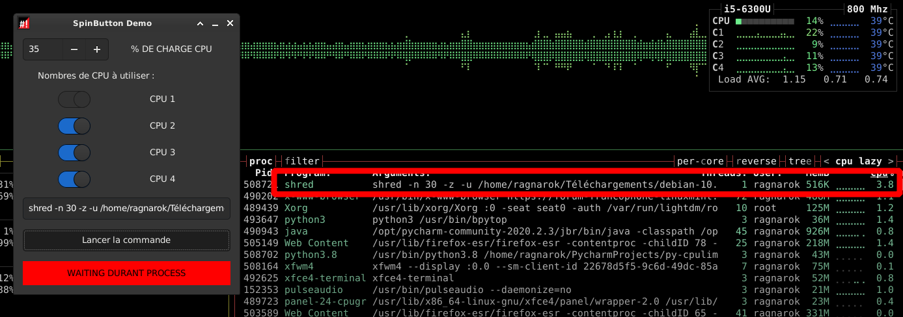

# pycpulimit-gtk

## Juste un utilitaire GTK afin de lancer une commande via cpulimit
  * permet de régler l'option --limit (taux de charge CPU accordée)
  * permet de régler le nombre de coeur accordé au processus (détection automatique)
  
## En développement

Rapport de bugs, **section issues**

## Installation

**Depuis le git**

```
git clone https://github.com/CyrilleBiot/pycpulimit-gtk.git
$ cd pycpulimit-gtk/
$ ./source/pycpulimit.py
```

**Depuis les paquets deb**

```
wget https://github.com/CyrilleBiot/pycpulimit-gtk/blob/main/pycpulimit-gtk_1.1.0_all.deb
apt install pycpulimit-gtk_1.1.0_all.deb
```

(à adpater à la version du paquet)


## Screenshoots


